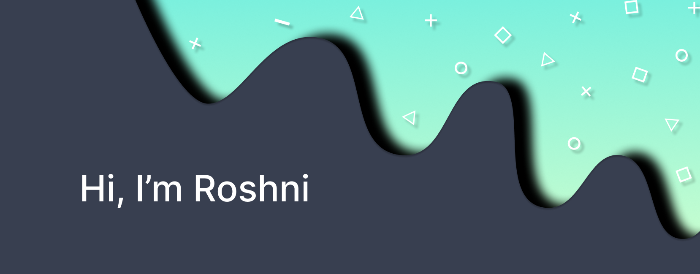

  

###

  
  
  
  

###

###

###

<h3 align="left">👩‍💻  About Me</h3>

###

- 🔭 Working as Web Developer  - 📖 Currently learning Machine Learning - 🗿 In my free time I clean my desk

###

<h3 align="left">🛠 Language and tools</h3>

###

 

 
 

 
 

###

<h3 align="left">🤺 My Stats :</h3>

###

